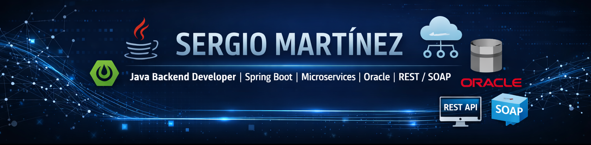

# Hi there, I'm Sergio Martínez 👋

### Java Backend Developer | Spring Boot | Microservices | Oracle | REST / SOAP

  
  

---

## About me

I'm a **Java Backend Developer from Mexico** with experience building enterprise applications, microservices, APIs, and data integration solutions.

My professional focus has been centered on:
- backend development with **Java 8+** and **Spring Boot**
- implementation and integration of **REST** and **SOAP** services
- enterprise system integration and database-driven solutions
- relational databases such as **Oracle**, **MySQL**, and **SQL Server**
- layered architecture using **DTO**, **DAO**, **JPA**, **JDBC**, and **Spring Data**
- agile environments with **Scrum**, API testing, and technical documentation

I also have working knowledge of frontend and complementary web technologies such as **Angular**, **React**, **Node.js**, **JavaScript**, **TypeScript**, **HTML**, and **CSS**, mainly as support skills for end-to-end collaboration.

I enjoy building solutions that are clean, maintainable, and aligned with real business processes.

---

## Core stack

### Backend

### Databases

### APIs, Tools and DevOps

### Complementary knowledge

---

## Professional highlights

- Built backend services and integration flows with **Java + Spring Boot**
- Worked on **microservices** and enterprise transactional systems
- Implemented and consumed **REST / SOAP APIs**
- Integrated data across **Oracle** and other relational databases
- Used **DTO**, **DAO**, **JPA**, **JDBC**, and layered architecture patterns
- Participated in agile teams using **Scrum** and collaborative delivery practices
- Collaborated with complementary frontend technologies when required by the solution

---

## Experience snapshot

- **Grupo Salinas** — Java Developer
- **IDS Comercial** — Java Back-end Developer
- **Continental** — Java Back-end Developer
- **Tata Consultancy Services** — Java Back-end Developer

---

## What you can expect in my GitHub

Here you'll find repositories related to:
- Java backend development
- Spring Boot APIs
- microservices architecture
- Oracle and relational database integration
- clean code and layered architecture
- technical exercises and professional practice projects

---

## Connect with me

  

Thanks for visiting my profile.

---

⭐️ From [@SergioMtnz26](https://github.com/SergioMtnz26)
